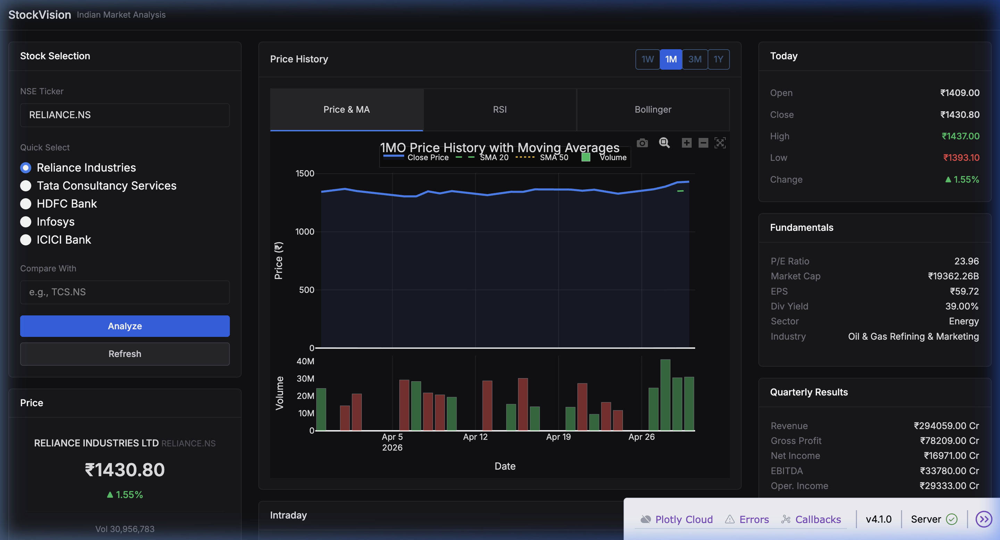
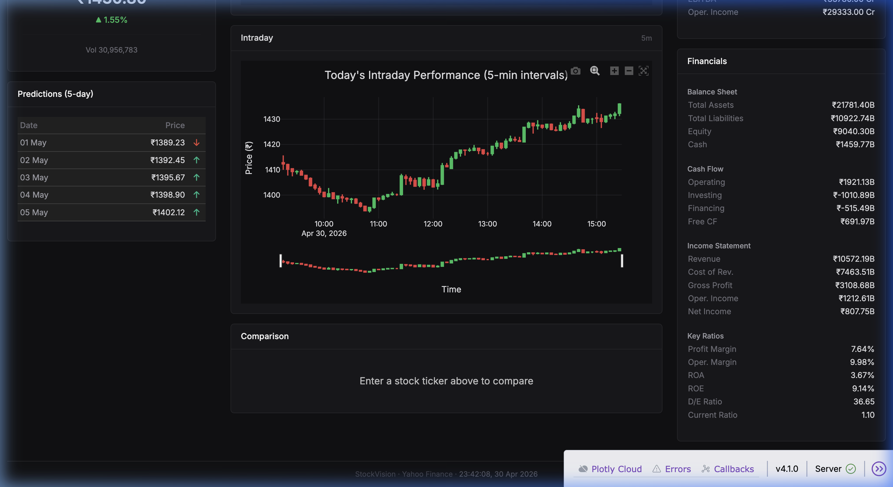

# StockVision

A professional-grade stock analysis dashboard for the Indian market (NSE). Built for analysts and traders who need real-time data, technical indicators, financial statements, and price predictions in a single interface.



---

## Features

### Market Data
- **Live Quotes** — Current price, OHLC, volume, and percentage change for any NSE-listed stock
- **Intraday Charts** — 5-minute interval candlestick charts for today's trading session
- **Configurable Timeframes** — Switch between 1W, 1M, 3M, and 1Y historical views

### Technical Analysis
- **Price History with Moving Averages** — SMA 20 and SMA 50 overlaid on closing price
- **RSI (Relative Strength Index)** — Momentum oscillator with overbought/oversold reference zones
- **Bollinger Bands** — Volatility bands with standard deviation-based upper/lower bounds
- **Stock Comparison** — Normalized percentage-change comparison between any two tickers

### Fundamentals & Financials
- **Company Fundamentals** — P/E ratio, EPS, dividend yield, market cap, sector, and industry
- **Quarterly Results** — Revenue, gross profit, net income, EBITDA, and operating income
- **Balance Sheet** — Total assets, liabilities, stockholders' equity, and cash position
- **Cash Flow Statement** — Operating, investing, financing cash flows, and free cash flow
- **Income Statement** — Revenue, COGS, gross profit, operating income, and net income
- **Key Ratios** — Profit margin, operating margin, ROA, ROE, D/E ratio, current ratio

### Predictions
- **5-Day Price Forecast** — Linear regression-based predictions for the next five trading days with trend indicators



---

## Tech Stack

| Component | Technology |
|-----------|-----------|
| Framework | Dash + Dash Bootstrap Components |
| Charts | Plotly |
| Data | yfinance (Yahoo Finance API) |
| ML | scikit-learn (Linear Regression) |
| Processing | pandas, NumPy |
| NLP | TextBlob |
| Scraping | BeautifulSoup4, Requests |

---

## Getting Started

### Prerequisites

- Python 3.8+
- Active internet connection (for live market data)

### Installation

```bash
git clone https://github.com/GarvRandhar/Stock-Market-Analysis.git
cd Stock-Market-Analysis
pip install -r requirements.txt
```

### Usage

```bash
python project.py
```

The dashboard opens automatically at `http://127.0.0.1:8051`.

Enter any NSE ticker (e.g., `RELIANCE.NS`, `TCS.NS`, `ICICIBANK.NS`) and click **Analyze**.

---

## Project Structure

```
Stock-Market-Analysis/
├── project.py          # Main application (layout, callbacks, ML logic)
├── requirements.txt    # Python dependencies
├── screenshots/        # Dashboard screenshots
├── LICENSE             # MIT License
└── README.md
```

---

## Design

The interface uses a neutral zinc-based dark theme optimized for extended use and data density:

- **Background**: `#111113` with `#18181b` card surfaces
- **Typography**: Inter font family, compact sizing
- **Data Tables**: Two-column label-value layout without decorative icons
- **Charts**: Minimal chrome, muted grid lines, clean hover labels
- **Color Signals**: Green/red reserved exclusively for positive/negative data indicators

---

## Auto-Refresh

The dashboard automatically refreshes market data every 5 minutes. Use the **Refresh** button for manual updates at any time.

---

## Contributing

1. Fork the repository
2. Create a feature branch (`git checkout -b feature-name`)
3. Commit changes and open a pull request

---

## License

MIT — see [LICENSE](LICENSE) for details.
